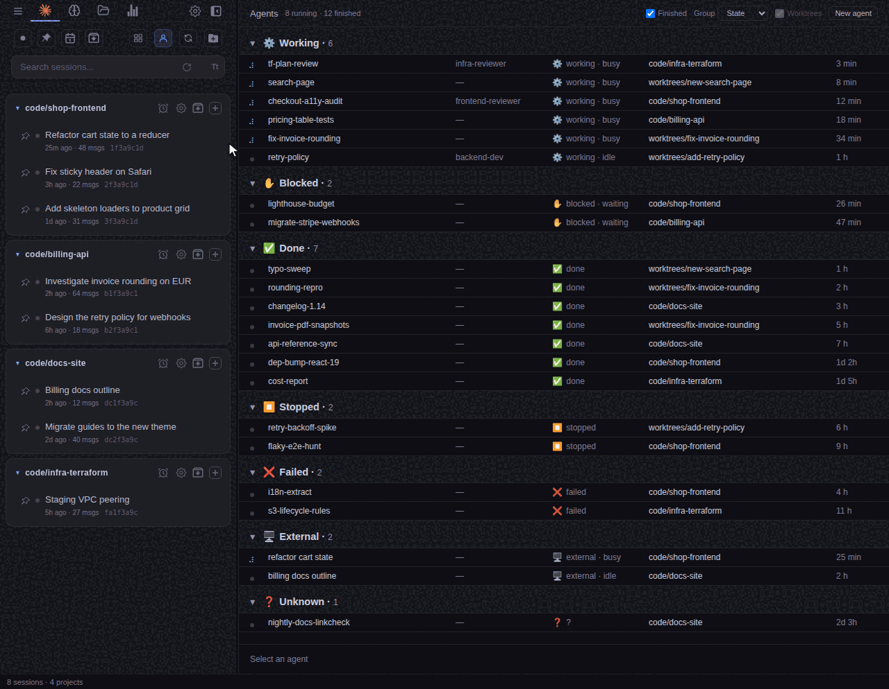

# Background agents

The Agents view is Switchboard's replacement for the `claude agents` TUI: it
lists the sessions the Claude CLI daemon runs in the background
(`claude --bg`) and the interactive `claude` sessions running outside this
Switchboard, and acts on them without a terminal.

## Opening it

The people icon in the sidebar's filter row, or `Ctrl+Shift+A` (`Cmd+Shift+A`
on macOS; [rebindable](keyboard-shortcuts.md)). The same toggle closes it and
brings back whatever was there: the grid, the active session, or the
placeholder. Opening any other view (Agent Files, Work Files, Settings, the
grid, Stats) closes it. Whether the view is open is remembered across
restarts.

## The list

One row per session: a state glyph (the same rungs as the sidebar: spinner
while busy, orange while waiting, green when idle, grey when finished), its
name, its `--agent`, its state emoji then `state · status` (see the table
below), its directory, and its age. Working
and blocked sessions and external interactive sessions come first, newest
first. **Finished** shows or hides `done`, `stopped` and `failed` sessions;
the choice is remembered. The list refreshes when the daemon's files change,
and is re-read from the CLI every 30 seconds while the view is open.

**Group**, next to Finished, splits the list into sections with a header
each (its name and how many rows it holds):

- **State** (the default): Working, Blocked, Done, Stopped, Failed, then
  External for the interactive sessions running outside Switchboard, then
  Unknown. Each header starts with the state's emoji.
- **None**: one flat list.
- **Project**: one section per project, named after its folder (hover the
  header for the full path; two projects with the same folder name show
  their parent folder too). All the worktrees of one git project — the
  `.claude/worktrees/<name>` ones as well as any `git worktree add`
  directory, and any subdirectory of them — fall under the project's main
  checkout. A directory that is not in a git repository is its own project.
  Projects with something running come first, then the rest alphabetically;
  sessions without a directory go under No project.

**Worktrees**, next to Group (checked by default, remembered), adds a second
level in Project mode: inside a project, one smaller sub-header per worktree
with its own count — **main** for the main checkout, the worktree's folder
name for the others (hover for the full path). Sub-headers only appear for a
project whose sessions run in more than one worktree; a project that lives in
a single worktree stays a flat list under its header. Worktrees with
something running come first, then main, then the others alphabetically. The
box is greyed out in the other modes.

Click a header (or focus it and press Enter or Space) to fold its section:
the header keeps its name and count, its rows are hidden; folding a project
hides its worktree sub-sections too. The arrow at the start of the header
shows which sections are folded. It works in every grouping, each grouping
remembers its own folded sections, and they stay folded across refreshes and
restarts. A selected session in a folded section stays selected.

Rows keep their usual order inside a section, the Finished filter applies
first (a section left empty is not shown), and the choice is remembered.

A job is in one of five states: `working`, `blocked` (live, waiting for
input), `done`, `stopped` or `failed` (ended in error). `working` and
`blocked` both count as live; the other three are finished.

The same emoji marks a state in the State headers and at the start of every
row's state column, whatever the grouping:

| Emoji | State |
|---|---|
| ⚙️ | Working |
| ✋ | Blocked (waiting for input) |
| ✅ | Done |
| ⏹️ | Stopped |
| ❌ | Failed |
| 🖥️ | External (an interactive session outside Switchboard) |
| ❓ | Unknown |

Selecting a row opens its detail: the daemon's one-line status, tokens,
model, start time, pid, the subagents it ran, the links it produced (merge
requests open in the browser), its last result, and the verbs:

A finished job whose conversation is still running interactively appears as
one live External row, keeping its job details. It remains visible when
Finished is unchecked. Its Respawn and Delete buttons are disabled; hover
them to see the pid holding the conversation.

| Verb | Runs | Available |
|---|---|---|
| Attach | `claude attach <id>` in a terminal tab | while the session is live (`working` or `blocked`) |
| Transcript | the read-only transcript viewer | whenever the transcript exists |
| Stop | `claude stop <id>`; the conversation is kept | while live |
| Respawn | `claude respawn <id>` | a background session that is not live |
| Delete | `claude rm <id>`, after confirmation; the worktree goes too when that is safe | a background session that is not live |

An external interactive session offers Transcript only. A live session is
never resumed: attach is the only way into it. To respawn or delete one, stop
it first.
Switchboard checks again before Respawn or Delete, and before Stop on a
finished job. A conversation held by an open terminal or another live process
is refused even if the job says stopped or done. If the process or job files
cannot be read, the action is refused with a reason. Stop remains available
for a working or blocked daemon job.

Transcript stays disabled until its file is available in the session index;
hover the button for the reason. A file removed after a refresh produces an
error in the read-only viewer.

## Attaching

Double-click a row you can attach to (a live `working` or `blocked` session,
with the daemon answering) to attach, the same as the **Attach** button in the
detail pane. A double click on a finished or external session, on a group
header or on a button does nothing extra.

An attach tab is an ordinary terminal tab running `claude attach`. Its stop
button reads **Detach**: closing the tab sends Ctrl+Z, the attach client
leaves, and the session keeps running under the daemon. Stopping the session
is only offered in the Agents view. Attach tabs are not reopened by
[session restore](session-restore.md). Quitting Switchboard or closing its
window ends the attach client without the Ctrl+Z; the session still keeps
running.

A click in the sidebar on a session the daemon is running attaches to it
instead of asking to resume it. Once the Agents view has been opened, such a
row carries a `bg` badge while the job is live; the badge goes when the job
finishes, and a finished background session resumes like any other.

## New agent

**New agent** opens a dialog: prompt, project, name (`--name`), agent
(`--agent`), permission mode or Dangerous Skip, additional directories. It
runs `claude --bg …` in the project directory and selects the new row. A
prompt starting with `-` is refused, since the CLI would read it as a flag.

The permission mode, Dangerous Skip and additional directories are filled from
the chosen project's settings, and filled again when you pick another project.
Remote projects are not offered: the agent runs on this machine.

A project that runs its sessions sandboxed, or that has a pre-launch command,
cannot start a background agent: the daemon starts the agent itself, outside
the sandbox and without the pre-launch command. The dialog says so and Start
stays disabled; start a session in that project instead.

A session that a background job is still running cannot be archived or
deleted from the sidebar: stop the job from the Agents view first. Archiving
a folder that holds one is refused when **Archive the sessions** is checked.
Unchecked, the folder is only hidden: no session is archived or detached, and
the job keeps running and stays in the Agents view. A session live in another
process cannot be deleted either. When Switchboard cannot tell, for example because `~/.claude/jobs`
cannot be read, it refuses and says why.

## When the daemon does not answer

The view reads two files the CLI writes for itself, `~/.claude/jobs/<id>/state.json`
and `~/.claude/sessions/<pid>.json`, and asks `claude agents --json --all`
which sessions exist. When that command fails, a banner says so, the list
comes from the files alone, and every verb but Transcript is disabled.
Neither file is a documented interface; a CLI upgrade may change them, and
`test/canary-bg-agents-files.test.js` says so when it happens.

At most 200 job directories are watched; in that file-only mode the list
shows only the jobs among them.
